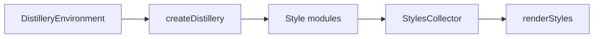

# Distillate

{{pkg}} is a CSS style engine for component libraries. You author styles once, against your own tokens. The engine emits a public stylesheet with stable names, or a tree-shaken compact payload for HTML that leaves the app.

One runtime dependency, for `emotion`-style syntax: [stylis](https://github.com/thysultan/stylis.js) 4.4.0. No brand is baked in.

```ts
import { createDistillery, cq, lightDark } from '@elastic/distillate';

const distillery = createDistillery({
  prefix: 'eui',
  themeScope: '.eui-view',
  theme: {
    colors: { ink: lightDark('#111', '#eee') }, // theme variable
    gap: cq('8px', '2cqi'), // inlines as `8px`
  },
});

const demo = distillery.createStyleModule('demo', ({ css, tokens }) => ({
  root: css`
    color: ${tokens.colors.ink};
    padding: ${tokens.gap};
  `,
}));

distillery.renderStyles(distillery.stylesheetCollector()); // default readable classes: `.demo-root`

const collector = distillery.artifactCollector('compact'); // compact classes and vars: `.a`, `--a`
collector.use(demo.handles.root);
distillery.renderStyles(collector);
```

## How it works

1. **Bind.** `createDistillery` takes a prefix and a nested theme tree; it derives `tokens` and `themeVars`.
2. **Author.** Tagged templates (`css`, `rule`, `media`, `variants`) record every token and var they touch.
3. **Collect.** A `StylesCollector` keeps the entries a render actually reached. Unused variants and unread custom properties drop out.
4. **Emit.** `renderStyles` writes CSS in readable or compact names, for a full stylesheet or a single artifact.



## Why Distillate

Distillate is for **component library authors** who need the same authored styles to work two ways: a public stylesheet with stable names for host applications, and a compact self-contained CSS payload for HTML that leaves the app (emails, AI reply cards, SVG renders, exported reports).

- **Two outputs from one source.** Readable names for apps; compact names for payloads where HTML and CSS travel together.
- **Reachability, not static analysis.** Collection runs during a real render — class-name resolution is the side effect that builds the collected set. Unused entries and unread theme tokens drop out automatically.
- **Your tokens.** `tokens` is the tree you passed in. The engine never invents a palette.
- **Emotion-shaped opt-in.** `@elastic/distillate/emotion` is `css` / `cx` / `injectGlobal` over the same registry for incremental adoption.
- **Testable CSS.** `@elastic/distillate/testing` asserts every `var(...)` has a matching declaration.

See [Distillate vs CSS-in-JS](guides/vs-emotion.md) for a side-by-side comparison with Emotion, CSS Modules, vanilla-extract, and Tailwind.

## Next

- [Install](getting-started/installation.md) and [quick start](getting-started/quick-start.md)
- [The output matrix](concepts/naming-and-output.md)
- [Declare and select themes](guides/theming.md)
- [Integrate with a React renderer](guides/react-renderer.md)
- [Playground](https://elastic.github.io/distillate/playground/)
- [API reference](reference/index.md)
