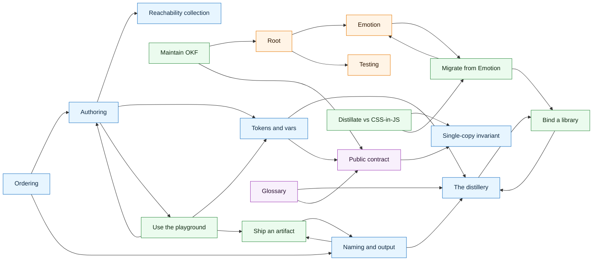

# OKF map

Generated from `.okf/distillate` by `pnpm okf:map`. Do not edit by hand.

- Concepts: 18
- Links: 27
- Isolated concepts: 0

## Graph

## Concepts

- Authoring (Concept): `concepts/authoring`
- Reachability collection (Concept): `concepts/collection`
- The distillery (Concept): `concepts/distillery`
- Naming and output (Concept): `concepts/naming`
- Ordering (Concept): `concepts/ordering`
- Single-copy invariant (Concept): `concepts/single-copy`
- Tokens and vars (Concept): `concepts/tokens`
- Emotion (Entry Point): `entry-points/emotion`
- Root (Entry Point): `entry-points/root`
- Testing (Entry Point): `entry-points/testing`
- Bind a library (Playbook): `playbooks/bind-a-library`
- Maintain OKF (Playbook): `playbooks/maintain-okf`
- Migrate from Emotion (Playbook): `playbooks/migrate-from-emotion`
- Ship an artifact (Playbook): `playbooks/ship-an-artifact`
- Use the playground (Playbook): `playbooks/use-the-playground`
- Distillate vs CSS-in-JS (Playbook): `playbooks/vs-emotion`
- Glossary (Reference): `reference/glossary`
- Public contract (Reference): `reference/public-contract`
